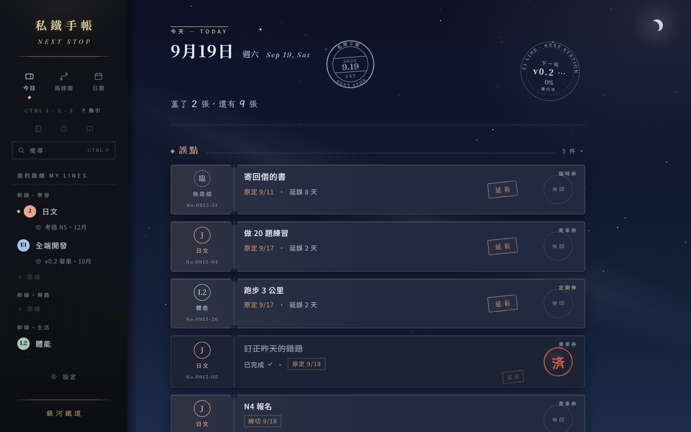

# 🚉 私鐵手帳 · 私鉄手帳 · Next Stop

> 把人生當成一條自己的私鐵來經營的個人生產力 App。
> A personal productivity app that runs your life like a private railway — tasks as tickets, goals as routes, milestones as stations. Local-first, end-to-end-encrypted sync, Windows + Android.

[](https://github.com/TipsyDrifter/next-stop/releases/latest)  

<p align="center">
  <br>
  
</p>

---

## 這是什麼

我想把散在 Notion、flomo、時間日誌、記帳 App 裡的人生紀錄收回同一個地方，而且要「順手到不費力、用久了看得到累積」。所以做了這個：

- **鐵道語彙的任務樹**：幹線（領域）→ 路線（目標）→ 列車（階段）→ 車票（待辦）→ 車站（里程碑）。層級不寫死，怎麼掛都行。
- **今日視圖**：今天要跑的班次一列排開，蓋一枚朱印「済」就完成；誤點的、繰越的、締切將至的各有標記。
- **定期券**：重複任務由規則排班，運休、改期都有語彙。
- **日曆**：締切標記層，月／週兩種視圖。
- **本地備份三件套**：每日自動快照、手動備份、第二備份位置，加 App 內還原。
- **雲端同步（v1.1）**：桌機 ↔ 手機雙向，端到端加密（密語可改）。任何一台都能「加入同步」，兩邊都有資料時問一次要合併還是改用另一台的；同一格兩邊都改時後改的贏、輸的那筆不丟，寫進該票的乘務記錄。
- **兩套主題**：粉彩星空／銀河鐵道，跟著系統深色模式走。

現況（2026-09）：**v1.1** 完成——桌機版任務管理已取代我自己的 Notion；Android 手機殼與雙向同步通車。筆記、時間記錄、記帳三個模塊在路線圖上，會一個功能一個小版本地推。

## 安裝

到 [Releases](https://github.com/TipsyDrifter/next-stop/releases/latest) 下載：

| 平台 | 檔案 | 備註 |
|---|---|---|
| Windows x64 | `NextStop_<版本>_x64-setup.exe` | NSIS 安裝檔。未簽章，SmartScreen 會擋一次：其他資訊 › 仍要執行。資料在 `%APPDATA%\app.shitetsu.nextstop\`。 |
| Android arm64 | `NextStop_<版本>_arm64.apk` | 側載安裝；同簽章可直接覆蓋升級。第一次掃配對碼時會要相機權限。 |

只用桌機也完全可以，同步是選配。

## 雲端同步怎麼開（自用階段的做法）

同步後端目前是 **Cloudflare R2**（S3 相容物件儲存，免費層綽綽有餘），需要你自己的帳號與 bucket。專案附一支精靈帶你走完：

```bash
bash scripts/setup-r2.sh
```

它會開瀏覽器帶你開通 R2、建 bucket、建一把只限該 bucket 的 API token，最後用 curl 實際列一次 bucket 驗證，把值寫到 `%LOCALAPPDATA%\NextStop\r2.env`（repo 外）。

然後在**任何一台**打開〔設定 › 同步〕（手機是〔更多 › 同步〕）按「加入同步」：填四欄＋一句密語（≥ 8 字）。桌機可按「從精靈匯入」自動填；手機掃另一台畫面上的配對碼，或把它貼進來。任何一台都可以是第一台，先加入的那台說了算。

要記的規則只有三條：

| | 規則 | 會發生什麼 |
|---|---|---|
| ① | **加入** | 雲端是空的 → 這台成為第一台；雲端有資料而這台是空的 → 直接拉下來；**兩邊都有資料 → 問你一次**：「兩邊都保留」（同一張票以較晚改的為準，被蓋掉的值寫進該票的乘務記錄）或「改用另一台的」（這台現有的先自動備份／匯出成 JSON 再換掉）。 |
| ② | **還原**（桌機） | 從備份還原時問一次：「回到過去」＝所有裝置都改用這份（備份之後的修改會消失，其他裝置還沒送出的修改另存成檔、**不會自動併回**）；「接上現在」＝只有這台換成備份，其他裝置比備份新的修改會再蓋回來（**刪除也算修改**——已經同步出去的誤刪找不回來）。還沒加入同步的機器不問，還原只動這一台；之後加入同步時若兩邊都有資料會問你要不要合併——所以**舊電腦壞了、只剩備份**時的正確順序是「先還原、再加入同步，加入時選『兩邊都保留』」。 |
| ③ | **重新加入** | 「重新加入同步」＝把這台拿掉再放回去，回到①重問一次。清掉的是這台的同步設定、憑證與身分，資料與雲端上的東西都不動。 |

只是**換了一把 R2 token**（或把外流的舊 token 撤銷了）不必走③：到〔設定 › 同步〕按「更新憑證…」重填四欄＋現在的密語就好，資料、身分與紀元都不動。每一台各自更新一次。

**密語可以改，忘了也改得了。** 資料是用一把隨機的資料鑰匙加密的，密語只負責把那把鑰匙包起來放在雲端，所以改密語＝重包那一顆鑰匙物件：**資料不重傳、其他已加入的裝置不受影響**（之後新加入的裝置要用新密語）。已加入的裝置手上本來就有資料鑰匙，所以〈密語〉頁的「現在的密語」**可以留白**——忘記密語不必重配任何東西，直接設一個新的即可。兩台同時改＝後送上去的那次生效。

已知限制（v1.1.4 會處理）：改密語只換「包裝」，沒有換資料鑰匙，所以**舊密語仍然開得了舊的鑰匙物件副本**；從 v1.1.2 升上來的桶更徹底——那份資料的鑰匙是舊密語直接派生的，而派生用的鹽明文放在桶裡，等於舊密語＋桶就推得出鑰匙。改密語擋得住「拿到密語的人再加一台」，擋不住「已經抄走舊密語與桶內物件的人」。要真的換鎖＝換一把資料鑰匙把全部重新加密，那是之後的工。

變更日誌以 XChaCha20-Poly1305 加密後才上傳，伺服器只存密文；R2 的 token 與這台的裝置身分存在系統鑰匙圈（Windows Credential Manager）／App 私有目錄，**不放在資料庫裡**——所以備份還原不會換掉裝置身分，而把整個資料夾複製到另一台就是「新的一台」，走①合併進來。忘記密語不會弄丟任何東西：已加入的裝置照常同步（它們用的是資料鑰匙），到〈密語〉頁留白現密語直接設一個新的，就能再加新裝置。真的走投無路（所有裝置都沒了、只剩備份與桶）才需要人工重來一次：到 Cloudflare 後台刪掉 `<root>/SALT`、`<root>/KEY` 與所有紀元目錄，再從有資料的那台「加入同步」當第一台，其餘裝置會變成「鍵違い」，各自「重新加入同步」選「兩邊都保留」即可。

> 要求使用者自建 R2 顯然不適合對外的正式版；換成普及帳號同步或代管服務是之後要重談的題目。

## 從原始碼建置

需要 Node 22+、pnpm 10+、Rust 1.95+；Android 另需 JDK 17、Android SDK 34/35、NDK 28（安裝方式與雷區見 [docs/發版流程.md](docs/發版流程.md)）。

```bash
pnpm install
pnpm tauri dev                  # 桌機開發（vite 1425 + cargo）
pnpm tauri build --bundles nsis # 桌機安裝檔
pnpm tauri android build --apk --target aarch64   # Android APK（需先 android init 過的環境）
```

瀏覽器只看畫面：`pnpm dev` 後開 `http://localhost:1425/?mock=1`（假資料，不碰 SQLite）。

發版一行：`bash scripts/release.sh <版號> --notes docs/release-notes/v<版號>.md`。

## 技術

Tauri 2 · React 19 · TypeScript · Vite 7 · Tailwind 4 · Zustand · SQLite（tauri-plugin-sql / sqlx）· 同步引擎 Rust（object_store → R2、HLC 欄位級 LWW、argon2id + XChaCha20-Poly1305）。

```
src/            React 前端（ui/ 依頁面分：today、outline、calendar、settings、mobile…；data/ repository 層；store/ zustand）
src-tauri/      Rust：lib.rs 掛 plugin；backup.rs 備份三件套；sync/ 同步引擎；migrations/ SQL
scripts/        setup-r2.sh（R2 精靈）、release.sh（發版）、mirror-publish.sh（發到公開鏡像）
docs/           發版流程、release-notes、截圖
```

> 這個公開 repo 是私有開發 repo 的鏡像：只含程式碼、安裝包與說明文件，沒有開發歷史；每做完一個功能就整包推一次。

## 路線圖

| 版本 | 內容 | 狀態 |
|---|---|---|
| v1.0 | 桌機任務管理（樹、今日、定期券、日曆、備份、主題） | ✅ 2026-09-15 |
| v1.1 | Android 手機殼＋雲端同步（E2EE、雙向、衝突、還原紀元）＋發版流程 | ✅ 2026-09-20 |
| v1.2 | 旅客筆記：靈感收集＋日記（桌機主） | 下一站 |
| v1.3 | 時刻表：時間記錄（手機主） | |
| v1.4 | 售票口：記帳（桌機主） | |

想法與回饋歡迎開 issue 丟進來。

## 關於

這是我和我的 AI 搭檔小紗一起做的專案：我當設計師與 PM，她當工程師。

MIT License。

> 「願這條軌道一直延伸到你想去的所有地方」♡
